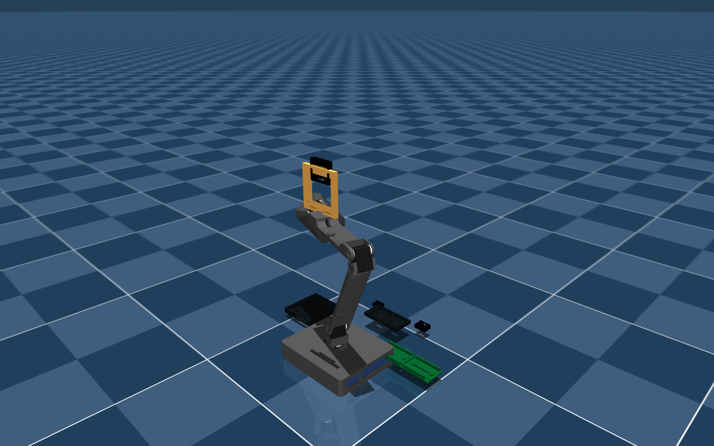

# Team 8 — Interactive Robot Lamp (LeLamp-based)

**Course:** Embedded Systems, Cyber-Physical Systems and Robotics (INHN0018) — TUM Campus Heilbronn, Summer 2026
**Team:** Group 8 · **Presentation:** 09.09.2026, from 13:00 (online)
**Upstream:** built on [LeLamp](https://github.com/humancomputerlab/LeLamp) and [lelamp_runtime](https://github.com/humancomputerlab/lelamp_runtime) by Human Computer Lab — **GPL-3.0**

A desk lamp that sees and talks: a 5-DOF ST3215 arm on a Jetson, with camera-based person/pose
detection, expressive motion playback, addressable LED feedback, a voice agent
(LiveKit / OpenAI Realtime), and a MuJoCo digital twin used for offline motion development.



---

## 1. Course deliverables — where to find them

| # | Required item | Location in this repository |
|---|---|---|
| 1 | **Video** demonstrating the project in action | [`docs/video/`](docs/video/) |
| 2 | **Technical report** (project, methodology, findings) | [`docs/report/`](docs/report/) |
| 3 | **Presentation slides (PDF)** | [`docs/slides/`](docs/slides/) |
| 4 | **All code** | repository root: `ailamp_runtime/`, `firmware/`, `simulation/`, `scripts/`, `config/`, `tests/` |
| 5 | **Repository link** (this repo) | <https://github.com/CPSCourse-TUM-HN/TUM-HN-Team8_LeLamp> |

Submission status and the full checklist: [`SUBMISSION.md`](SUBMISSION.md). Team and roles: [`TEAM.md`](TEAM.md).

## 2. What we built on top of the upstream project

Upstream LeLamp provides the mechanical design, the MJCF/URDF model and the base motion runtime.
Our contribution (see [`NOTICE.md`](NOTICE.md) for the exact file-level provenance):

- **Jetson platform bring-up** — two hardware profiles: Orin Nano Super (local YOLO person/pose
  detection) and Jetson Nano 4GB (API-hybrid, no local large models), selected purely by config.
- **Redesigned lamp base** that hides the Jetson electronics: generated replacement shell and cover
  (`3D/AILamp_Adapters/`) scaled from the original LampBase form, plus tray/deck and cable clips.
  Print-ready files in [`3D/print_ready/`](3D/print_ready/).
- **Perception → behaviour layer** — vision events (person near/left/right, posture) mapped to motion
  recordings and LED colours through a configurable `[behavior_map]`.
- **Voice + vision fusion** — an agent tool layer that combines the current vision state with spoken
  intent and can drive the physical outputs.
- **Pico WH LED controller firmware** (`firmware/pico_led_controller/`) over a serial protocol, with
  level shifting to the NeoMatrix.
- **Peripheral integration** — Arducam UB0234 camera, Seeed ReSpeaker XVF3800 microphone array.
- **Simulation scene** for the modified base (`simulation/ailamp_scene.xml`) so motions can be
  validated without hardware.
- **Test suite and local verification** (`tests/`, `scripts/verify_local.sh`) plus a CI workflow.
- **Bilingual build documentation** (`docs/en/`, `docs/zh/`).
- *Experimental:* an LLM decision layer behind a local safety gate (`poc_claude_brain/`) — not part
  of the graded core system, included for completeness.

## 3. Quick start

```bash
git clone https://github.com/CPSCourse-TUM-HN/TUM-HN-Team8_LeLamp.git
cd TUM-HN-Team8_LeLamp
python3 -m venv .venv && source .venv/bin/activate
pip install -e ".[test]"
ailamp runtime-check          # environment sanity check
ailamp sim-check              # MuJoCo smoke test (needs .[simulation])
```

On the lamp itself (Jetson): `pip install -e ".[hardware,voice]"` (Orin) or `pip install -e ".[nano]"`
(Nano 4GB), then `ailamp hardware-check --include-devices` before running anything with `--with-outputs`.

Full setup, CLI reference, hardware profiles and project layout:
**[`docs/technical-overview.md`](docs/technical-overview.md)**.
Build guides: [`docs/en/`](docs/en/) · [`docs/zh/`](docs/zh/). Hardware BOM and printing guide:
[`docs/hardware/`](docs/hardware/).

## 4. Repository layout

```text
.
├── ailamp_runtime/        Python runtime package (services, agent, CLI)
├── firmware/              Raspberry Pi Pico WH LED controller
├── simulation/            MuJoCo MJCF model, URDF, STL assets, our scene
├── 3D/                    Upstream .3mf parts, our adapter kit, print-ready exports
├── config/                Hardware/runtime profiles (Orin Nano Super, Jetson Nano 4GB)
├── scripts/               Generators, renderers, verify_local.sh
├── tests/                 Unit tests
├── deploy/                systemd units
├── poc_claude_brain/      Experimental LLM decision layer (not graded core)
└── docs/
    ├── report/  slides/  video/     course deliverables
    ├── en/  zh/                     build guides
    ├── hardware/                    BOM + 3D printing guide (PDF)
    ├── media/                       renders and screenshots
    └── technical-overview.md        full technical README
```

## 5. Licence and attribution

This project is a derivative work of LeLamp and is therefore released under the **GNU GPL v3**
(see [`LICENSE`](LICENSE)). Copied upstream assets — 3D print files, MuJoCo/URDF simulation assets and
motion recording CSVs — and the exact upstream commits are listed in [`NOTICE.md`](NOTICE.md).
